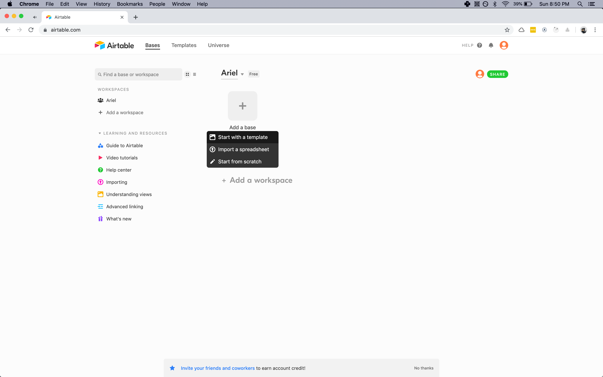
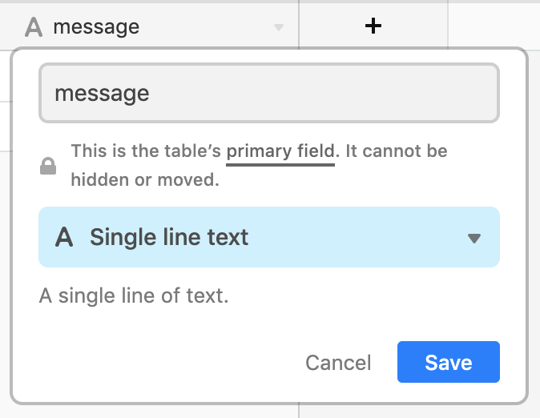
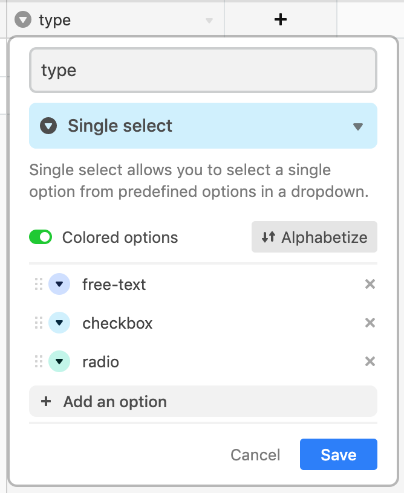
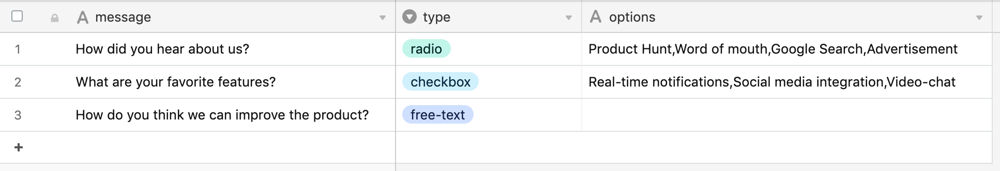

TODO:

- ADD AIRTABLE KEYS WARNING
-

In this post I will show you how to create a simple feedback widget with configurable options
using React.js and Airtable.

In case you don't know what [Airtable](https://airtable.com/) is, it's a spreedsheet app (like Google sheets) that also allows us to visualize the records in different
types of views and provides us with an API. Using this API we can get all the
records and create new ones, and the Airtable spreedshet will be updated accordingly.

## What are we going to build?

We will build a simple feedback widget that posts the users responses to our Airtable spreedsheet/database.

PASTE CHATBOT IMAGE

Examples: https://www.zigpoll.com/

## Airtable configuration

If you don't have an account yet, sign up to Airtable. After this create a new base to store the chatbot configuration and user responses.

> An Airtable base contains all of the information you need for a particular project or collection. Each of the square icons on your homepage is a different base. It's kind of like a workbook in a traditional spreadsheet, and can contain multiple tables of content.



Now that we have our new base, let's create the chatbot configuration table. For this example we will create a simple configuration with three types of questions: free text, single option and multiple options.

We will need three fields to represent this configuration:

1. `message`: This field will represent the slide question or message.



2. `type`: The type of answer: for this example we will use three different types of feedback answers (free text, checkbox and radio inputs).



3. `options`: The list of options that the user can select (only for options types). We can define this using a single line text field with the multiple options separated by a comma (,).

After configuring the different fields we need to add records that represent each of the questions. Let's add the following questions:



## Project setup

We will need a new react project to get started and for this we will use [create-react-app](https://github.com/facebook/create-react-app) that allows us to
quickly create a new app without worrying about the scaffolding.

So let's create a new project using the following command:

```
npx create-react-app react-airtable-chatbot
```

Now we will install the `airtable` npm package so we can fetch the feedback widget steps configured in our "Chatbot Configuration" table.

```
npm install airtable
```

Let's use the [`useEffect`](https://reactjs.org/docs/hooks-reference.html#useeffect) hook from React to fetch the feedback widget configuration when the component is mounted. To do this we need to pass an empty array as the second argument for the `useEffect` function.

```javascript
React.useEffect(() => {
  base("Chatbot configuration")
    .select()
    .eachPage(records => {
      console.log("records", records);
    });
}, []);
```

If everything is okay you should see the following data logged into your console:

```json
{
  "records": [
    {
      "id": "rec2b5pmtRQXhTFF4",
      "fields": {
        "options": "Product Hunt,Word of mouth,Google Search,Advertisement",
        "type": "radio",
        "message": "How did you hear about us?"
      },
      "createdTime": "2019-09-02T02:16:58.000Z"
    },
    {
      "id": "recBRzg2WXpknxhyT",
      "fields": {
        "options": "Real-time notifications,Social media integration,Video-chat",
        "type": "checkbox",
        "message": "What are your favorite features?"
      },
      "createdTime": "2019-09-03T03:49:04.000Z"
    },
    {
      "id": "recRGjx70lpo9LPz4",
      "fields": {
        "type": "free-text",
        "message": "How do you think we can improve the product?"
      },
      "createdTime": "2019-09-03T03:49:04.000Z"
    }
  ]
}
```

Let's save the configuration data in the component state and process the records so we only get the information that we need:

```javascript
const [config, setConfig] = React.useState();

React.useEffect(() => {
  base("Chatbot configuration")
    .select()
    .all()
    .then(records => {
      setConfig(
        records.map(record => ({
          ...record.fields,
          id: record.id,
          options: record.fields.options && record.fields.options.split(",")
        }))
      );
    });
}, []);
```

Now we need to add one component for each feedback slide type ("free-text", "radio" and "checkbox"). Let's create a folder called `screen-types` and create three files called `CheckboxScreen.js`, `RadioScreen.js` and `CheckboxScreen.js` inside it.

## More to read:

[Airtable fields reference](https://support.airtable.com/hc/en-us/articles/360021333094#basic-field-types)

https://css-tricks.com/getting-to-grips-with-the-airtable-api/
